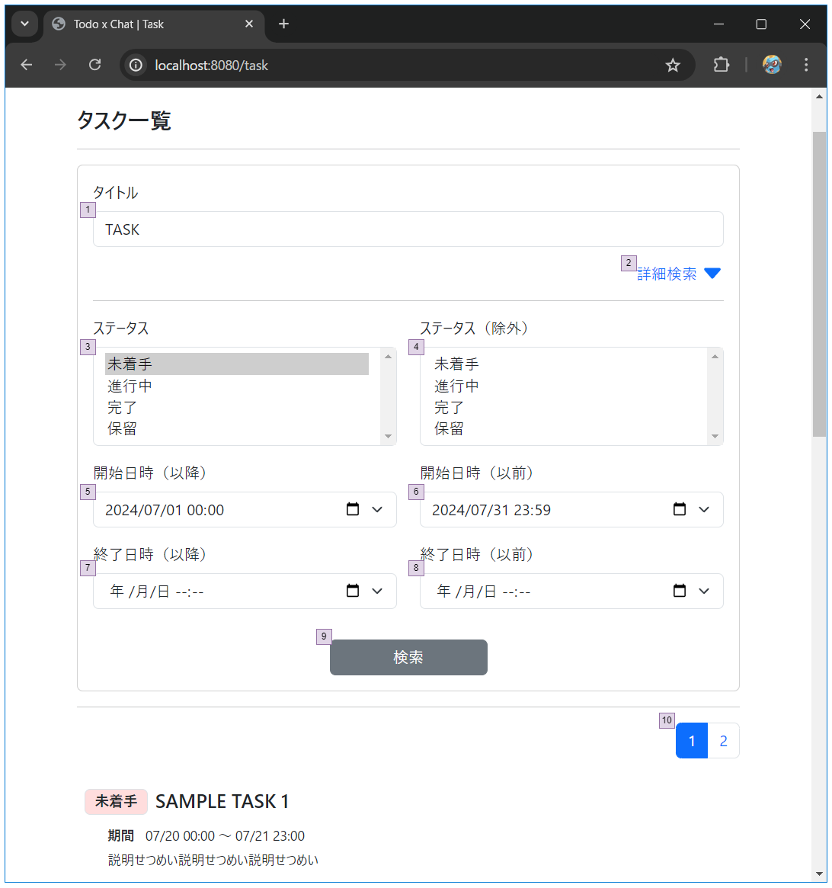
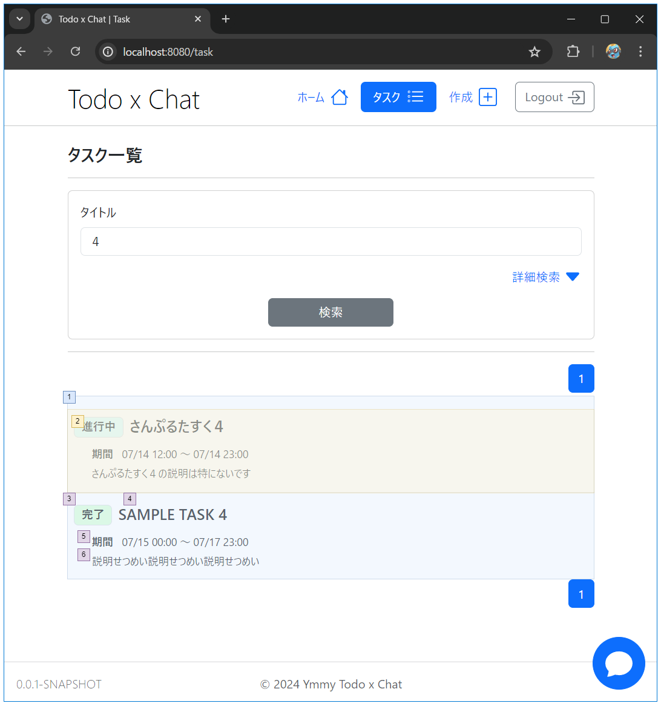

# タスク／一覧

## 画面設計

#### タスク一覧

#### タスク一覧

### 画面項目

#### タスク一覧検索

| 項番 | 項目               | 項目種別   | 項目チェック | 備考                       |
| ---- | ------------------ | ---------- | ------------ | -------------------------- |
| 1    | タイトル           | テキスト   |              | タイトル名で部分一致       |
| 2    | 詳細検索           | ボタン     |              | 詳細検索タブを表示・非表示 |
| 2    | ステータス         | プルダウン |              | 複数選択可                 |
| 2    | ステータス（除外） | プルダウン |              | 複数選択可                 |
| 3    | 開始日時（以降）   | 日付・時間 |              |                            |
| 3    | 開始日時（以前）   | 日付・時間 |              |                            |
| 4    | 終了日時（以降）   | 日付・時間 |              |                            |
| 4    | 終了日時（以前）   | 日付・時間 |              |                            |
| 6    | 検索               | ボタン     |              | 検索する                   |
| 7    | ページネーション   | ボタン     |              | 指定したページに移動する   |

#### タスク一覧

| 項番 | 項目       | 項目種別 | 項目チェック | 備考                               |
| ---- | ---------- | -------- | ------------ | ---------------------------------- |
| 1    | タスク一覧 | -        |              | 検索条件に一致するタスクを一覧表示 |
| 2    | タスク     | ボタン   |              | タスク詳細画面に遷移               |
| 3    | ステータス | -        |              |                                    |
| 4    | タイトル   | -        |              |                                    |
| 5    | 期間       | -        |              | タスクの開始日時と終了日時を表示   |
| 6    | 説明       | -        |              |                                    |

## ロジック設計

### 画面表示・タスク検索時のチェック処理

| 検証内容                                   | エラーメッセージ | 備考                   |
| ------------------------------------------ | ---------------- | ---------------------- |
| セッションに有効なuserIdが保存されていない | -                | ログイン画面に遷移する |

### 取得するデータ

- タスク一覧
  - 検索条件と一致するデータ
  - 加えて以下の条件に一致するすべてタスクを表示する
    - タスクの作成者 = ログインユーザー
