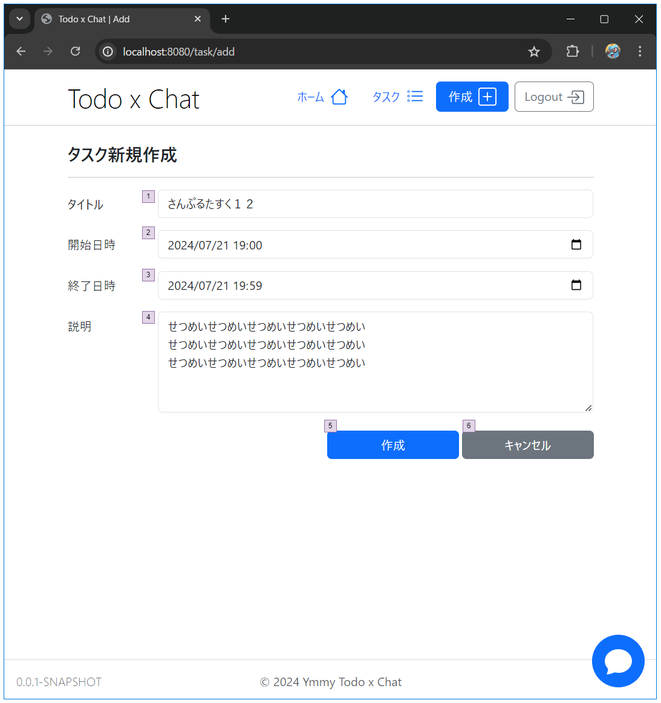

# タスク／新規作成

## 画面設計

#### タスク新規作成

### 画面項目

#### タスク新規作成

| 項番 | 項目    | 項目種別  | 項目チェック      | 備考         |
|----|-------|-------|-------------|------------|
| 1  | タイトル  | テキスト  | 必須 / 最大50文字 |            |
| 2  | 開始日時  | 日付・時間 | 必須          |            |
| 3  | 終了日時  | 日付・時間 | 必須          |            |
| 4  | 説明    | テキスト  |             |            |
| 5  | 作成    | ボタン   |             | タスクを作成する   |
| 6  | キャンセル | ボタン   |             | タスク一覧画面に遷移 |

## ロジック設計

### 画面表示時のチェック処理

| 検証内容                     | エラーメッセージ | 備考          |
|--------------------------|----------|-------------|
| セッションに有効なuserIdが保存されていない | -        | ログイン画面に遷移する |
| タスクが存在しないまたは操作権限がない      |          | 404を表示      |

### タスク新規作成時のチェック処理

| 検証内容                     | エラーメッセージ              | 備考          |
|--------------------------|-----------------------|-------------|
| セッションに有効なuserIdが保存されていない | -                     | ログイン画面に遷移する |
| 開始日時が終了日時より後の日時になっている    | 開始日時は終了日時より後に設定できません。 |             |

### 登録処理

#### taskテーブルに登録する

| カラム名            | 設定元  | 初期値               | 備考                 |
|-----------------|------|-------------------|--------------------|
| id              | -    | 無為採番              |                    |
| status_id       | -    | 1                 | 未着手のステータスを設定する     |
| title           | タイトル |                   |                    |
| description     | 説明   |                   |                    |
| start_date_time | 開始日時 |                   |                    |
| end_date_time   | 終了日時 |                   |                    |
| created_at      | -    | CURRENT_TIMESTAMP |                    |
| created_by      | -    | 1                 | #6 ログイン画面を実装した後に変更 |
| updated_at      | -    | CURRENT_TIMESTAMP |                    |
| version         | -    | 1                 |                    |