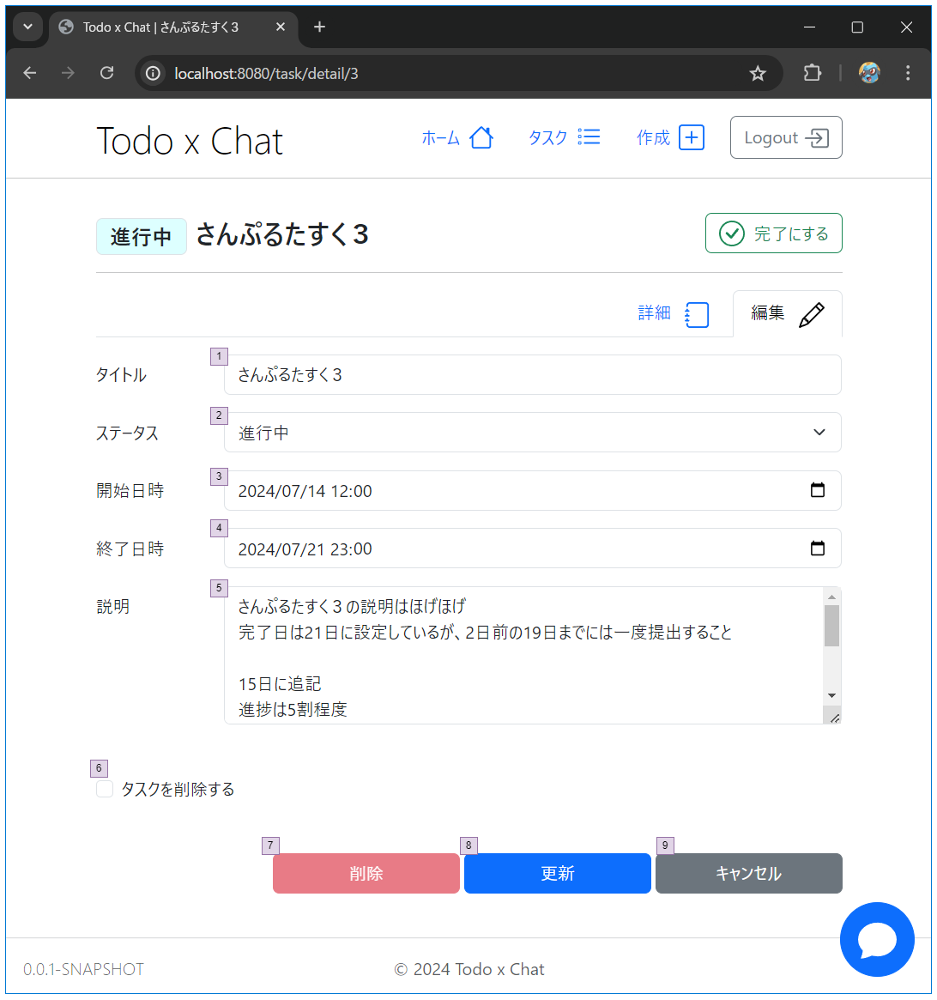

# タスク／詳細・編集

## 画面設計

#### タスク詳細

#### タスク編集

### 画面項目

#### タスク詳細

| 項番 | 項目        | 項目種別  | 項目チェック | 備考                               |
|----|-----------|-------|--------|----------------------------------|
| 1  | ステータス     | テキスト  |        |                                  |
| 2  | タイトル      | テキスト  |        |                                  |
| 3  | 完了（完了にする） | ボタン   |        | ステータスを完了にするボタン。 すでに完了の場合は非活性 |
| 4  | 詳細タブ      | ボタン   |        | 詳細タブを表示する                        |
| 5  | 編集タブ      | ボタン   |        | 編集タブを表示する                        |
| 6  | 詳細メッセージ   | テキスト  |        |                                  |
| 7  | ステータス     | テキスト  |        |                                  |
| 8  | 開始日時      | 日付・時間 |        |                                  |
| 9  | 終了日時      | 日付・時間 |        |                                  |
| 10 | 説明        | テキスト  |        |                                  |

#### タスク編集

| 項番 | 項目    | 項目種別  | 項目チェック      | 備考         |
|----|-------|-------|-------------|------------|
| 1  | タイトル  | テキスト  | 必須 / 最大50文字 |            |
| 2  | ステータス | プルダウン | 必須          |            |
| 3  | 開始日時  | 日付・時間 | 必須          |            |
| 4  | 終了日時  | 日付・時間 | 必須          |            |
| 5  | 説明    | テキスト  |             |            |
| 6  | 更新    | ボタン   |             | タスクを更新する   |
| 7  | キャンセル | ボタン   |             | 編集をキャンセルする |

## ロジック設計

### 画面表示時のチェック処理

| 検証内容                     | エラーメッセージ | 備考          |
|--------------------------|----------|-------------|
| セッションに有効なuserIdが保存されていない | -        | ログイン画面に遷移する |
| タスクが存在しないまたは操作権限がない      |          | 404を表示      |

### タスク更新時のチェック処理

| 検証内容                     | エラーメッセージ              | 備考          |
|--------------------------|-----------------------|-------------|
| セッションに有効なuserIdが保存されていない | -                     | ログイン画面に遷移する |
| タスクが存在しないまたは操作権限がない      |                       | 404を表示      |
| 開始日時が終了日時より後の日時になっている    | 開始日時は終了日時より後に設定できません。 |             |

### ステータス更新時のチェック処理

| 検証内容                     | エラーメッセージ | 備考          |
|--------------------------|----------|-------------|
| セッションに有効なuserIdが保存されていない | -        | ログイン画面に遷移する |
| タスクが存在しないまたは操作権限がない      |          | 404を表示      |

### タスク更新の更新処理

#### taskテーブルの該当データを更新する

| カラム名            | 設定元   | 初期値               | 備考 |
|-----------------|-------|-------------------|----|
| id              | -     |                   |    |
| status_id       | ステータス |                   |    |
| title           | タイトル  |                   |    |
| description     | 説明    |                   |    |
| start_date_time | 開始日時  |                   |    |
| end_date_time   | 終了日時  |                   |    |
| updated_at      | -     | CURRENT_TIMESTAMP |    |
| version         | -     |                   |    |

#### commentテーブルにコメントを登録する

| カラム名       | 設定元    | 初期値               | 備考      |
|------------|--------|-------------------|---------|
| id         | -      | 無為採番              |         |
| thread_id  | ユーザーID |                   |         |
| comment    |        |                   |         |
| status     | 100    |                   | ユーザー未確認 |
| created_at | -      | CURRENT_TIMESTAMP |         |
| created_by | -      | 0                 |         |

※ コメントは以下内容とする  
タスク「`task.title`（`task.start_date_time`～）」を更新しました。

### ステータス更新の更新処理

#### taskテーブルの該当データを更新する

| カラム名      | 設定元 | 初期値 | 備考                   |
|-----------|-----|-----|----------------------|
| id        | -   |     |                      |
| status_id | -   | 3   | 完了（status_id = 3）にする |

#### commentテーブルにコメントを登録する

| カラム名       | 設定元    | 初期値               | 備考      |
|------------|--------|-------------------|---------|
| id         | -      | 無為採番              |         |
| thread_id  | ユーザーID |                   |         |
| comment    |        |                   |         |
| status     | 100    |                   | ユーザー未確認 |
| created_at | -      | CURRENT_TIMESTAMP |         |
| created_by | -      | 0                 |         |

※ コメントは以下内容とする  
タスク「`task.title`（`task.start_date_time`～）」を完了にしました。
