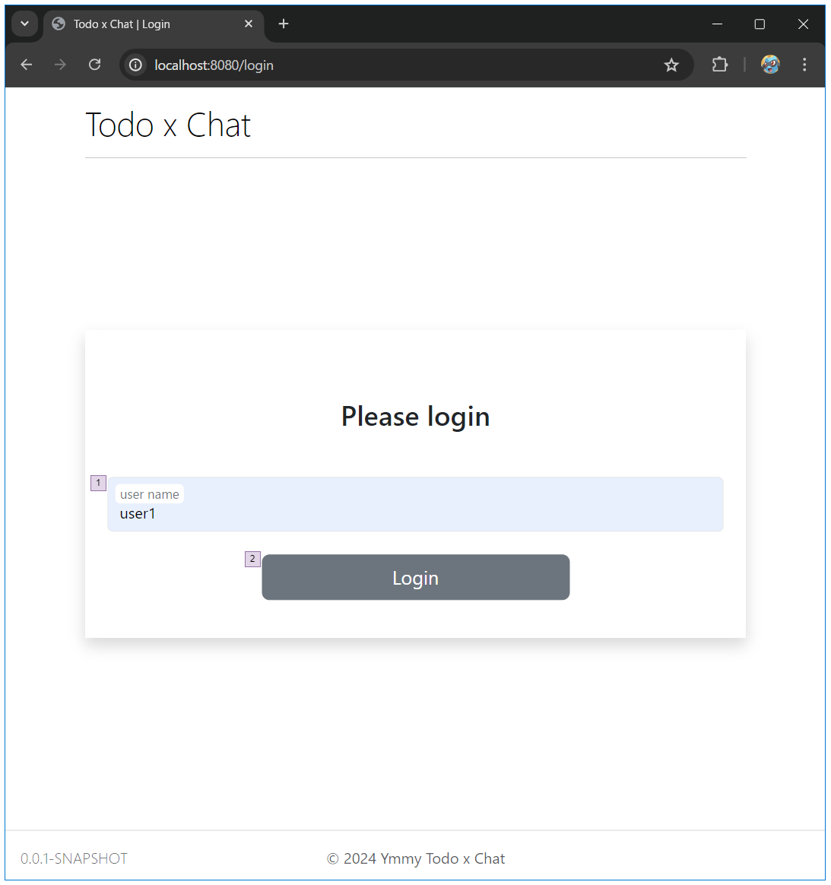

# ログイン

## 画面設計

#### ログイン

### 画面項目

#### タスク新規作成

| 項番 | 項目        | 項目種別 | 項目チェック           | 備考          |
|----|-----------|------|------------------|-------------|
| 1  | user name | テキスト | 必須 / [a-zA-Z0-9] |             |
| 2  | Login     | ボタン  |                  | ログインチェックを行う |

## ロジック設計

### チェック処理

| 検証内容                        | エラーメッセージ         | 備考 |
|-----------------------------|------------------|----|
| 指定したユーザー名に紐づくユーザー情報が存在しない場合 | ユーザーが見つかりませんでした。 |    |

### ログイン成功時の処理

- セッションにuserIdを保存する
- セッションの有効期限は30分とする
- ログイン成功後はホーム画面に遷移する
- 以降全ての画面において、セッションに有効なuserIdがない場合はログイン画面に遷移する
- セッションに有効なuserIdが保存されている場合、ログイン画面にアクセスするとホーム画面に遷移する

