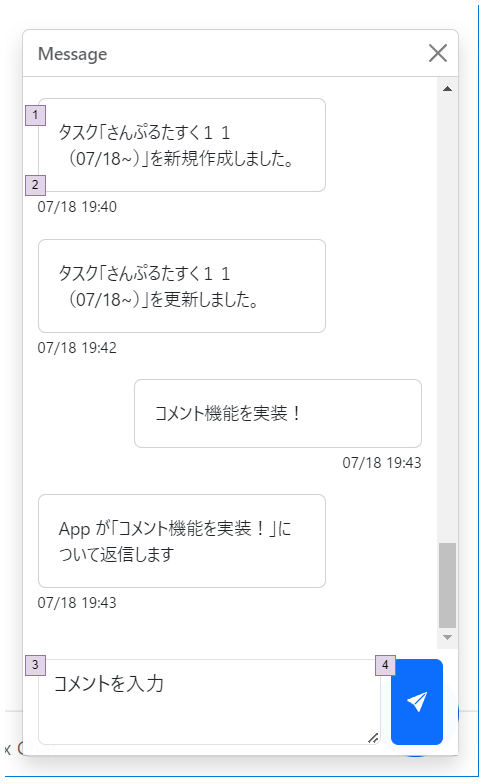

# コメント

## 画面設計

#### コメント

### 画面項目

#### コメント

| 項番 | 項目   | 項目種別 | 項目チェック | 備考                                |
|----|------|------|--------|-----------------------------------|
| 1  | コメント | -    |        |                                   |
| 2  | 作成日時 | -    |        |                                   |
| 3  | コメント | テキスト | 必須     |                                   |
| 4  | 送信   | ボタン  |        | コメントを登録する コメントがブランクの場合は送信できない |

## ロジック設計

### 取得するデータ

- 以下の条件に一致するすべてのコメントを表示する
    - コメントのスレッド = ログインユーザーID
- またユーザーが未確認のコメントについては、コメントの背景色が緑色となる

### commentテーブルにコメントを登録する

| カラム名       | 設定元    | 初期値               | 備考     |
|------------|--------|-------------------|--------|
| id         | -      | 無為採番              |        |
| thread_id  | ユーザーID |                   |        |
| comment    | コメント   |                   |        |
| status     | 200    |                   | App未確認 |
| created_at | -      | CURRENT_TIMESTAMP |        |
| created_by | ユーザーID |                   |        |

### コメントの確認

ユーザーがメッセージを開いたタイミングで同スレッドにおけるすべてのユーザー未確認のコメントを確認済みにする。
