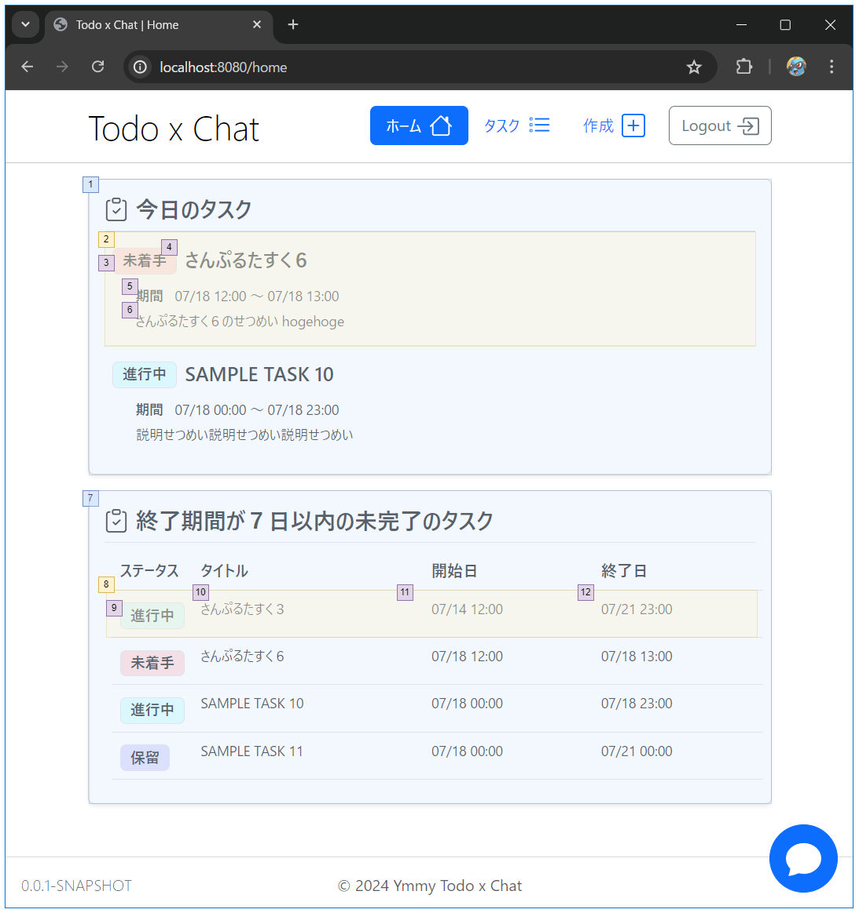

# ホーム

## 画面設計

#### ホーム

### 画面項目

#### ホーム

| 項番 | 項目                | 項目種別 | 項目チェック | 備考                     |
|----|-------------------|------|--------|------------------------|
| 1  | 今日のタスク            | -    |        | 今日のタスク一覧を表示する          |
| 2  | タスク               | リスト  |        | タスクの詳細画面に遷移する          |
| 3  | ステータス             | -    |        |                        |
| 4  | タイトル              | -    |        |                        |
| 5  | 期間                | -    |        | タスクの開始日時と終了日時を表示       |
| 6  | 説明                | -    |        |                        |
| 7  | 終了期間が７日以内の未完了のタスク | -    |        | 終了期間が7日以内の未完了のタスクを表示する |
| 8  | タスク               | リスト  |        | タスクの詳細画面に遷移する          |
| 9  | ステータス             | -    |        |                        |
| 10 | タイトル              | -    |        |                        |
| 11 | 開始日               | -    |        |                        |
| 12 | 終了日               | -    |        |                        |

## ロジック設計

### チェック処理

| 検証内容                     | エラーメッセージ | 備考          |
|--------------------------|----------|-------------|
| セッションに有効なuserIdが保存されていない | -        | ログイン画面に遷移する |

### 取得するデータ

- 今日のタスク
    - 以下の条件に一致するすべてタスクを表示する
        - タスクの作成者 = ログインユーザー
        - タスクの終了日時 = 今日の日付（23:59）
- 終了期間が７日以内の未完了のタスク
    - 以下の条件に一致するすべてタスクを表示する
        - タスクの作成者 = ログインユーザー
        - タスクの終了日時 = 今日の日付 + 7日後（23:59）
        - タスクのステータス != 完了（status_id = 3）